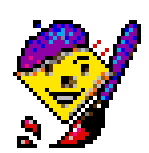
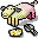
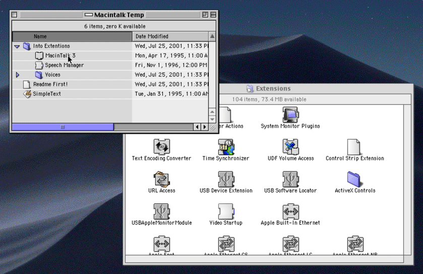
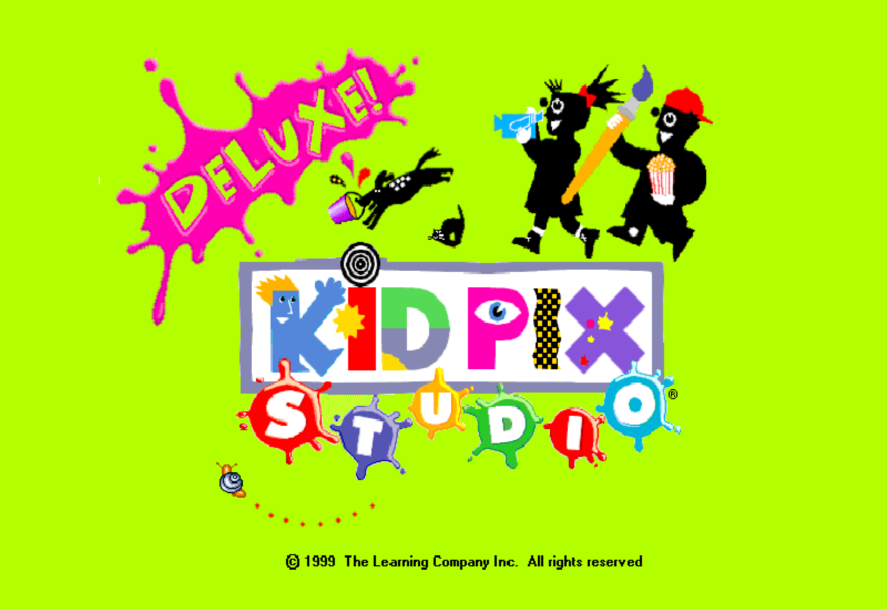
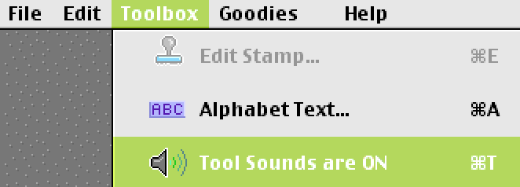
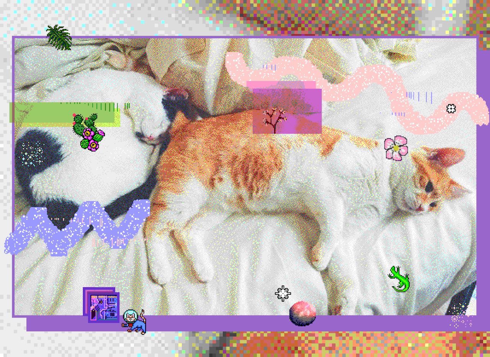

# Kid Pix Studio Deluxe on macOS

_**Kid Pix Studio Deluxe**_ 🎨, released in 1998, is something I grew up using on school computers and on my mom's Mac. At its core, it's a paint program, but packed with a surprise and delight that's missing from a lot of modern software design. Regardless, it's fucking fun and I want everyone to be able to experience it. 

For more background, I highly recommend reading [Craig Hickman's personal history of Kid Pix](http://red-green-blue.com/kid-pix-the-early-years/) and watching Just Another System's [recent interview with Hickman](https://www.youtube.com/watch?v=csalhuSixQU) about the unexpected legacy of Kid Pix.

---

Kid Pix Studio Deluxe runs on Mac OS 9. So unless you have an older Macintosh lying around (I do, but it's inconvenient), you'll need an emulator. 

Emulators are basically just a way for your computer to imitate the hardware of another type of computer– you can use them to run Windows-only software on your Mac or arcade games in your browser. 

> The [original shareware version](https://jamesfriend.com.au/pce-js/) of Kid Pix and [Kid Pix 1.0](https://archive.org/details/KID_PIX_DOS) can also both be emulated in the browser! 💻

The emulator we'll use to imitate Mac OS 9 is called SheepShaver. It's got a cute little icon! 

### 💾 Downloads
- [SheepShaver](http://ronaldpr.home.xs4all.nl/sheepshaverforum/SheepShaver_2.5_20190504.zip)
- [SheepShaver folder](http://ronaldpr.home.xs4all.nl/sheepshaverforum/SheepShaver_folder.zip)
- ["New World" PPC ROM](http://www.redundantrobot.com/sheepshaver_files/roms/newworld86.rom.zip)
- [Bootable Mac OS 9 disk image](http://www.redundantrobot.com/sheepshaver_files/disk_images/OS9.img)
- [Kid Pix Studio Deluxe install disk image](https://www.myabandonware.com/media/files/games/k/kid-pix-studio-deluxe_mac_03tz.zip)
- [MacinTalk installer](https://www.macintoshrepository.org/2590-macintalk#d4277)

*Big props to [Redundant Robot](http://www.redundantrobot.com/#/sheepshaver) for providing the OS 9 disk image and ROM.*

You'll also need to have a way to open `.sit` (StuffIt) archives. I like [The Unarchiver](https://theunarchiver.com/) for this, but you might already have something else installed.

### 📺 Setting up the emulator

Start by downloading everything in the above Downloads section, and unarchiving anything that's zipped or stuffed or whatever. 

The `SheepShaver` folder is where the really important stuff goes, so move it out of your Downloads into either your home folder or `Applications`. Then move the following files into it:

- `SheepShaver.app`
- `OS9.img`
- `Mac OS ROM`
- `macintalk3.img`
- `Kid Pix Studio Deluxe.toast`

Create another folder, preferably in your home folder, that you'll use to sync files in between your computer and the emulated operating system (I always name mine `sheepshare`, which is what I'll use to refer to this folder from now on).

Configure SheepShaver using [this guide](http://www.emaculation.com/doku.php/sheepshaver_mac_os_x_setup#configuring_sheepshaver). Keep the following in mind for Step 3:

- When creating the disk image that will be the "virtual hard disk", make sure it's at least 500 MB. If you plan on using the emulator for any other applications, bump that minimum up to 1000 MB
- The Unix Root setting corresponds to the `sheepshare` folder you made earlier
- Instead of an install CD image, we're using a pre-installed disk image. You'll need to click "Add..." and open `OS9.img` so that SheepShaver has something to boot from (don't check the CDROM box)
- While you've got Preferences open, add `macintalk3.img` and `Kid Pix Studio Deluxe.toast` as disks, too

Once you're done configuring SheepShaver, you can quit (`Ctrl-Esc`) and open it again to boot for the first time!

During start up you'll be asked to initialize a new volume (the virtual hard disk created earlier). Give it a name (I'll call it `System`) and choose `Mac OS Extended` for the format.

### 📀 Installing Kid Pix 

You're now using Mac OS 9 inside of macOS. That's pretty cool by itself! 🎉

Before we install Kid Pix, we need to do a little tidying. Right now the `System` disk is empty, but we want to make it bootable like `OS9`. Luckily, this is as easy as dragging the `System Folder` folder from `OS9` to `System`. 

Once that's done, open up `System Folder > Extensions` and also open the `MacinTalk Temp` drive. Drag everything in the `MacinTalk Temp > Into Extensions` folder into `Extensions`.

You can now install Kid Pix from the installer "disk" on the desktop! Just double click and it'll walk you through the steps. Make sure you choose to install it on the `System` disk. 

Now, open SheepShaver Preferences, select `OS9.img` from the list, and click "Remove". Do the same for `macintalk3.img`. Close SheepShaver (select "Shut Down", not "Restart").

Launch SheepShaver again and you'll be able to open Kid Pix!

### 🎷 Tips 
- Make sure to enable sound effects (under the Toolbox menu) when in Kid Pix mode

- "Picture" files saved by the main Kid Pix program are supposed to be just [PICT](http://fileformats.archiveteam.org/wiki/PICT) images. There's something weird about them though, and I've only been able to convert them using Photoshop 😰 **So for your final images, use "Export a Graphic" instead of "Save a Picture"**  

- Leave `Kid Pix Studio Deluxe.toast` mounted as a disk within SheepShaver, as some of the features rely on files that don't get copied over during install 🤔

### 🛠 Caveats 

While this is the most complete copy of Kid Pix Studio Deluxe I've been able to find online so far, it's not perfect. Neither is the emulator! 

##### What does work:
- Kid Pix mode and most of its features
- Moopies
- Stampinator (sometimes)
- Slideshow (sometimes)
- Digital Puppets (at your own risk)

##### What doesn't:
- Wacky TV (seems like it loads movie files alright, but can't display the video)
- "Pick a ColorMe" in Kid Pix mode (files are missing)
- Stamps work 🙏🏻, but when mousing over the canvas with them there's significant lag (this seems like an emulator issue)

---

Did these instructions work? Show me what you made! Did they not work? Tell me what broke. I'm [@cubeghost](https://twitter.com/cubeghost) on Twitter, and the source of this article [is on Github](https://github.com/cubeghost/personal-static-site/blob/development/src/kidPix/assets/tutorial/tutorial.md). 

